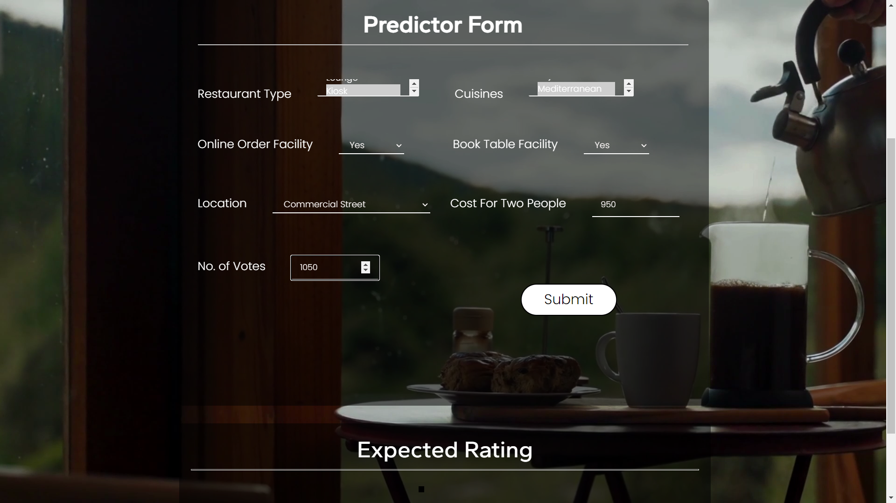
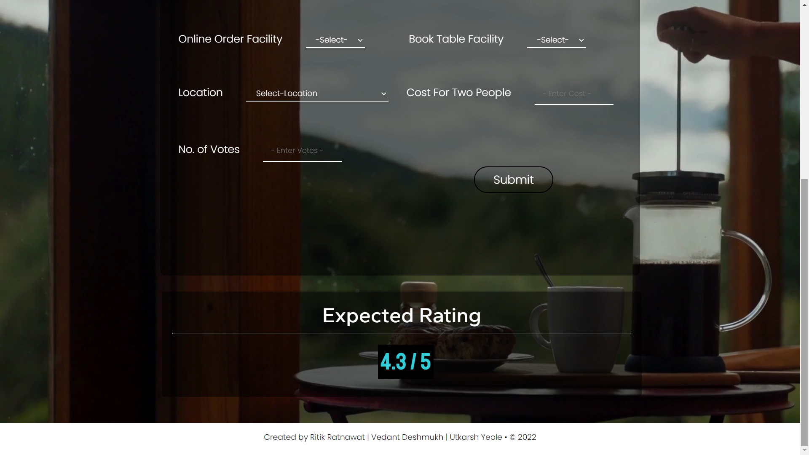

# Restaurant_PREDICTION 
Problem Statement: 
The main goal of this project is to perform extensive Exploratory Data Analysis(EDA) on the Zomato Dataset and build an appropriate Machine Learning Model that will help various Zomato Restaurants to predict their respective Ratings based on certain features. 
Used Python Libraries for data analysis and HTML, CSS for creating Web UI (frontend) for the project. 

Web UI:
1. Home Page 
When the User land on our webpage, he/she sees a webpage welcoming them to Restaurant Rating Prediction System and ask them to move further by clicking on the ‘Lets Go!’ button. 
 

Predictor Page 
This is the next page that can be accessed by clicking on ‘Lets Go!’ button on the homepage or by clicking on predictor tab in the navigation bar on the homepage The user sees various fields asking for information that is required to predict the rating of the restaurant. Once all the inputs are given, user clicks on 'Submit' button. The page refreshes and displays the predicted rating of the restaurant in the section below the form. 
 
User Input: 
On the predictor page, the user has to provide all the information asked for the prediction. The user can select from the drop down lists , can select multiple enteries from the list and enter input (as asked) in each of the fields. Once, all the asked information is provided, the user clicks on submit button to get the output. 
 
Output: 
On the predictor page, the user provides all the asked information and then clicks on submit button. The predicted rating of the restaurant is displayed to the user below the predictor form 
 

